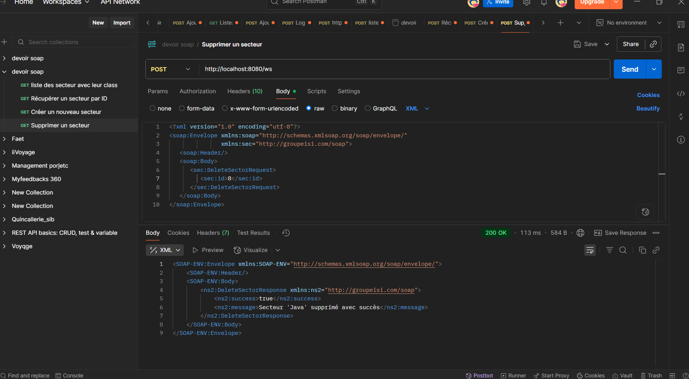
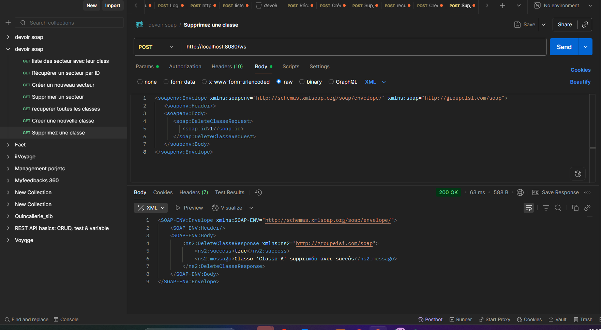

# Environnement de développement

## Prérequis

- **JDK** : Java 21 (compatible OpenJDK)
- **Build Tool** : Maven 3.9+
- **Serveur** : Tomcat 10 (intégré via Spring Boot)
- **Base de données** : MySQL 8.0+

## Screenshots du projet

### Image 1 : Création d’un nouveau sector

### Image 2 : Récupération d’un sector et de ses classes associées

### Image 3 : Suppression d’un sector

### Image 4 : Création d’une nouvelle classe

### Image 5 : Récupération de toutes les classes

### Image 6 : Suppression d’une classe

